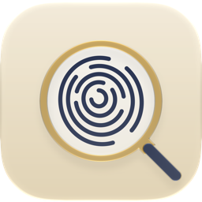

<p align="center">
  
</p>

<h1 align="center">SherlockMe</h1>

<p align="center">
  <strong>Click the Touch ID key. The Mac locks. It stays locked.</strong><br>
  The Touch ID key has had exactly one job since it shipped, and macOS still fumbles it. SherlockMe does it
  properly, from the menu bar, and does nothing else.
</p>

<p align="center">
  
  
  
  
  
</p>

## Why does this app even exist?

Honestly? **Why the fuck does this app even have to exist?**

Apple put a button on the Mac that locks it, and made that same button the sensor that unlocks it. Then
nobody in Cupertino stopped to ask what happens to the finger that just pressed it. Here's what happens: the
finger is still there, the lock screen reads it, and your Mac unlocks itself about a second after you locked
it. Well done.

What it needed was a debounce. **A FUCKING DEBOUNCE.** The thing every keyboard, every mouse and every
doorbell has had for decades. Lock, then ignore the finger that did it for a moment. That's it. But hey,
what do I know, I'm not a world-class UX genius. The people who shipped Liquid Glass clearly had more
important things to polish.

And the lock itself? Sometimes a click locks the Mac. Sometimes macOS just goes *fuck you, I'm not locking*,
and doesn't. Sometimes it wants a long press, sometimes a short one, and which one it wants today is yours
to find out.

So here is a menu-bar app that makes a button do what a button does. You're welcome, Apple.

## What it does

**1. Click the key, the Mac locks. Every time.** No long press, no short press, no guessing. SherlockMe
locks the instant the key goes down: 0.09 to 0.14 s after the press, where macOS on its own takes 0.38 s,
on the days it can be fucked to lock at all.

**2. The finger that locked the Mac doesn't unlock it.** macOS gives an app no way to stop the lock screen
from reading a finger. Every way around that was tried and measured, and each one fails
([docs/pitfalls.md](docs/pitfalls.md)). So SherlockMe does the next best thing: when the lock screen unlocks
with the finger that was already resting on the key, SherlockMe locks the Mac again half a second later,
once per press.

In practice you barely ever see it. A lock you can trust means you click and let go, instead of pressing
and hoping, so your finger is off the sensor long before the lock screen looks. And when it does happen,
it's half a second.

**3. Unlocking on purpose still works.** Only a finger the lock screen finds within its first half-second
of reading counts as the one that pressed the key. Lift your finger and put it back to unlock, and you'll
be slower than that: the author tried hard to beat it and couldn't. A click of the key on the lock screen,
your password, or a touch that comes any later are all left alone.

**4. Touch ID in your other apps is untouched.** While an app reads your finger (a password manager, `sudo`,
the App Store, System Settings), macOS ignores a click of the sensor, and so does SherlockMe: the
authentication goes on. The lock screen is the exception: click the key right after unlocking with Touch ID
and it locks, where macOS alone would ignore you for 3 s.

| You do | What happens |
|---|---|
| Click the Touch ID key | The Mac locks the instant the key goes down |
| Leave your finger on the key after the click | If the lock screen unlocks with it, SherlockMe locks the Mac again half a second later, once |
| Touch the sensor on the lock screen, click the key there, or type your password | The Mac unlocks, and stays unlocked |
| Click the sensor while an app is reading your finger | Nothing, as macOS does: the authentication goes on |

- There is nothing to set up and nothing to choose, and SherlockMe asks for no permission.
- It needs an **administrator account**: it watches the key through the Mac's own log, which only an
  administrator can read. On any other account it does nothing, and says so.
- It holds nothing in macOS and changes no setting. When SherlockMe is not running, the key goes back to
  Apple's version, moods included.

## Settings

A four-page window, opened from the menu-bar item (⌘,) or by opening the app again, which is the way in
when the icon is hidden. Every change applies as you make it. There is nothing to set about the Touch ID key
itself.

| Page | What is on it |
|---|---|
| **General** | Launch at login · Show in menu bar · Updates · Quit · Uninstall |
| **System** | the way back to the welcome wizard |
| **Health** | whether SherlockMe is watching the Touch ID key, when it last locked the Mac and last caught an unlock |
| **Tip** | everything is free and stays free · a one-time tip on Ko-fi |

The menu-bar item carries Launch at Login, what SherlockMe is doing, Settings and Quit.

SherlockMe speaks **English and French**, following the language your Mac is set to.

## Install

Download the disk image from
[the latest release](https://github.com/bambidotexe/sherlock-me/releases/latest), open it and drag
**SherlockMe** to Applications, then open it once. It is signed with a Developer ID and notarized by Apple,
so it opens without a warning. No release is published yet; until one is, build it from this repository.

The first launch opens a short welcome wizard: what the app does, then where it lives. Settings › System ›
Start over opens it again.

From this repository instead:

```sh
make install
```

That builds the same signed, notarized bundle, puts it in `/Applications` and opens it, leaving no `.app`
and no `.dmg` anywhere under the repository.

SherlockMe keeps itself up to date. It looks for a newer version when it starts and once a week, and tells
you with a notification. Click **Update**, there or in Settings › General, and a small window fetches it;
**Install and Relaunch** then swaps the app and reopens it, and says so when it is back. Nothing is fetched
or installed without a click.

**Settings › General › Uninstall** is how it comes off: it removes the Login Items entry, removes its
settings and its update folder, moves itself to the Trash and quits. Dragging it to the Trash yourself
leaves the first behind, pointing at an app that is gone.

## Build from source

```sh
swift build         # three targets and the probe
swift test          # two bundles; read both summary lines
make app            # assembles build/SherlockMe.app
make install        # the real thing, into /Applications
```

It is a SwiftPM package with no Xcode project and no third-party dependency. `make app` wants full Xcode for
the `actool` that compiles the app icon; with the Command Line Tools alone it still builds, warns, and ships
the flat icon without Liquid Glass.

## Requirements

- **macOS 26 or later**, and a Swift toolchain to build it.
- Measured on **macOS 27**. SherlockMe has not been tried on macOS 26; whatever happens there, the key still
  locks the way macOS does.
- **A Touch ID key**: built into the Mac, or on a Magic Keyboard with Touch ID.
- **An administrator account.** SherlockMe watches the key through the Mac's own log, which only an
  administrator can read. On any other account it does nothing and says so.
- **No permission.** The only thing the app ever sends over the network is its own update check.

## Documentation

| | |
|---|---|
| [CLAUDE.md](CLAUDE.md) | The operating manual for working on it: what it is, where each change lands, commands, rules, traps, status. Start here. |
| [docs/README.md](docs/README.md) | The index of the documents below. |
| [docs/functional.md](docs/functional.md) | What it does: every rule, every number. Authoritative. |
| [docs/architecture.md](docs/architecture.md) | Targets, threading, persistence, the update, the build. |
| [docs/shared/](docs/shared/README.md) | What every app of this family shares: the conventions, the workflow, the platform facts, the traps, the walks. |
| [docs/manual-test-checklist.md](docs/manual-test-checklist.md) | What only a person can see. |

## Support

SherlockMe is free and carries no ads. If it saves you trouble, you can leave a tip on
[Ko-fi](https://ko-fi.com/bambidotexe).

## Notes

- Personal build: English and French.
- The app icon is a magnifying glass over a fingerprint; the menu-bar item draws the same mark. See
  `Resources/ICON-NOTES.md`.
